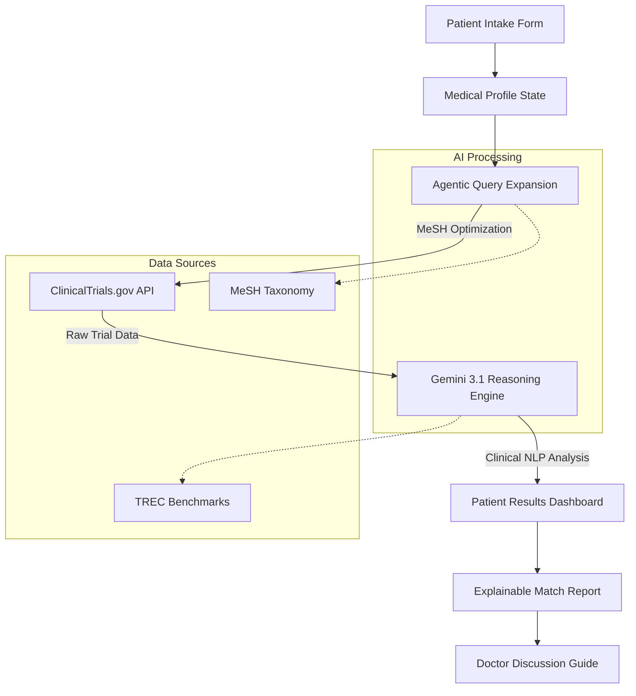

# Product Requirements Document (PRD): TrialMatch AI

## 1. Overview
TrialMatch AI is an intelligent clinical trial matching platform designed to bridge the gap between complex medical research and patient understanding. By leveraging large language models (LLMs) and standardized medical taxonomies (MeSH), the application translates patient health profiles into optimized clinical search queries and provides plain-language eligibility analysis.

## 2. Problem Statement
Patients seeking clinical trials often face "medical-speak" barriers. Traditional search tools rely on keyword matching (e.g., "Cancer"), which often yields thousands of irrelevant results. Understanding complex inclusion/exclusion criteria requires medical expertise, leading to missed opportunities for life-saving treatments.

## 3. Goals & Objectives
- **Precision Matching**: Use agentic reasoning to move beyond keywords to symptom/biomarker alignment.
- **Accessibility**: Translate clinical requirements into clear, patient-friendly explanations.
- **Doctor-Ready Output**: Generate standardized discussion guides for patients to bring to their oncology or primary care appointments.
- **Data Integrity**: Utilize ClinicalTrials.gov API and MeSH terminology for industry-standard reliability.

## 4. Technical Architecture

## 5. Key Features
### 5.1 Patient Intake Intelligence
- Sequential intake for Basics, Medical History, Treatments, and Preferences.
- MeSH-based normalization of symptoms and conditions.

### 5.2 Agentic Search Strategy
- Backend expansion of patient inputs into professional medical search strings.
- Real-time querying of 500,000+ studies via ClinicalTrials.gov.

### 5.3 Explainable AI (XAI) Analysis
- **Match Score**: 0-100% confidence rating.
- **Why it Matches**: Bulleted logic points based on clinical criteria.
- **Possible Concerns**: Flags for potential disqualifiers (e.g., specific prior medications).
- **Doctor Checklist**: AI-generated questions specific to that trial's study design.

### 5.4 Saved Trials & Tracking
- Persistence of interesting trials for later comparison.
- Offline-ready "Print for Doctor" summaries.

## 6. Technical Stack
- **Frontend**: React 18, Vite, Tailwind CSS, Motion/React (Animations).
- **Backend**: Node.js (Express), Server-side Gemini API Integration.
- **LLM**: Gemini 3.1 (for clinical NLP and agentic reasoning).
- **Data Sources**: ClinicalTrials.gov API v2.
- **Standards**: MeSH (Medical Subject Headings), TREC 2021/2022 Benchmarks.

## 7. Security & Compliance
- **Data Privacy**: All patient profile data is processed transitively and never stored on third-party databases without encryption.
- **Medical Disclaimer**: Integral UI banners across all views emphasizing that the tool is informational and not diagnostic.
